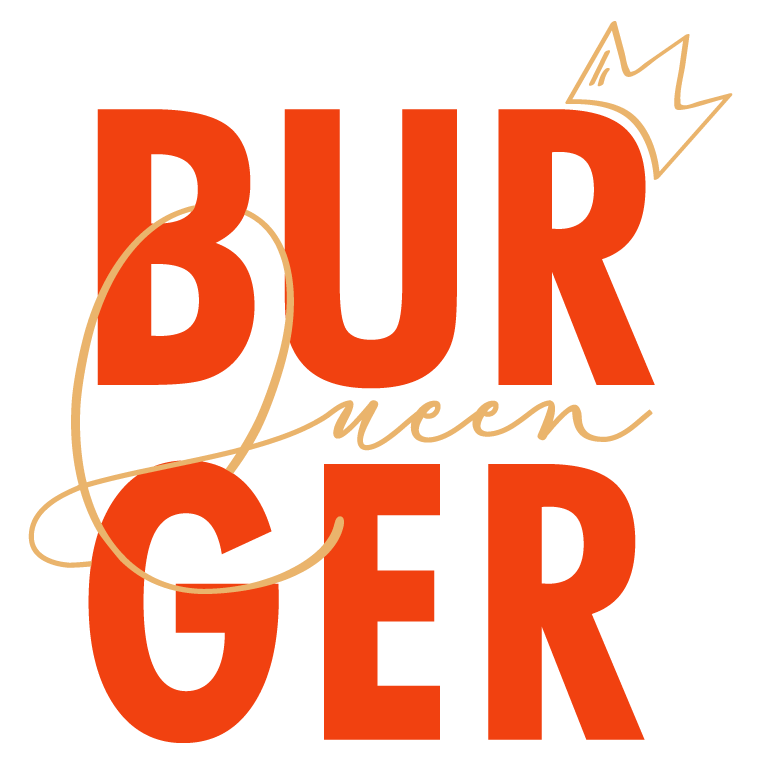
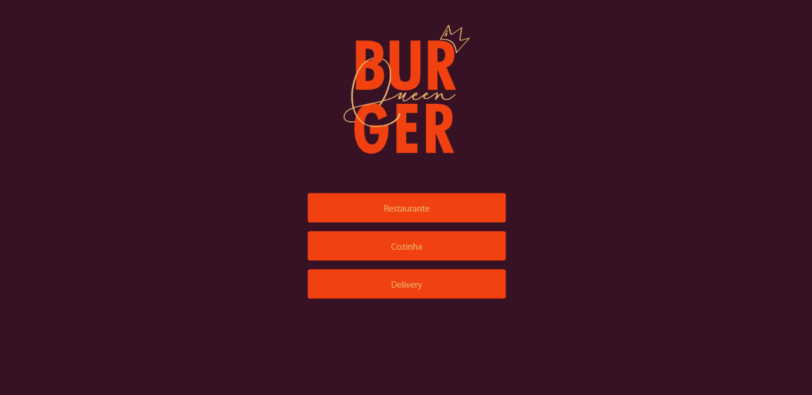
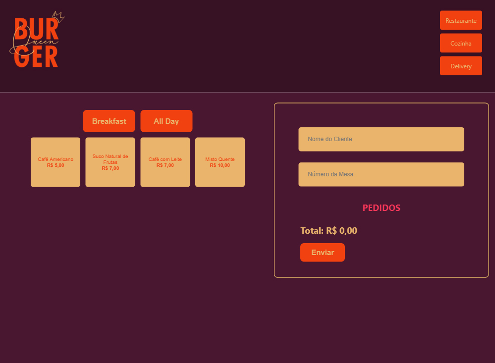
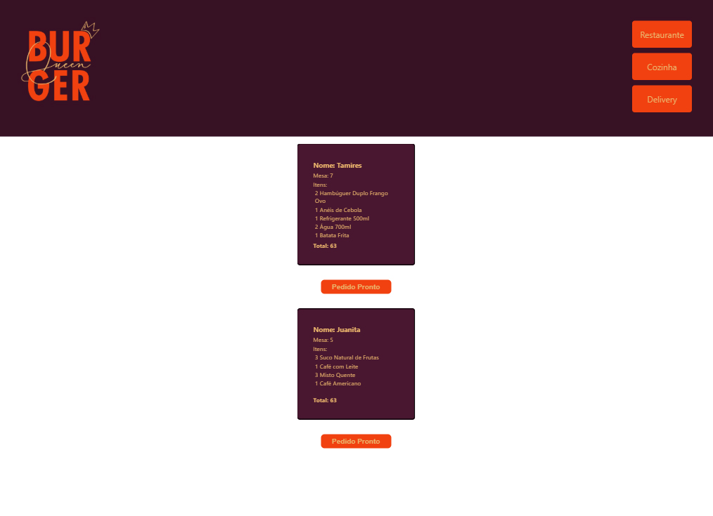
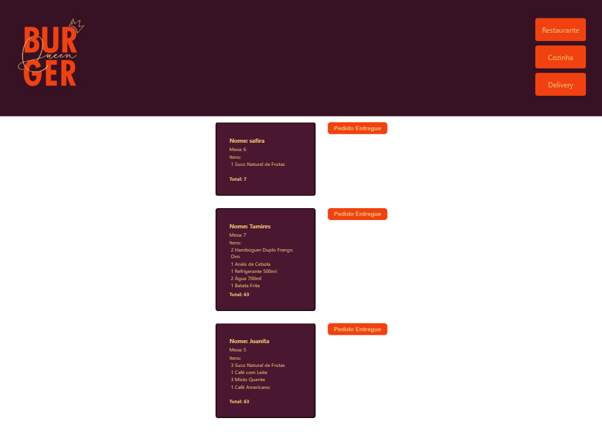

# Burger Queen

## Índice

* [1. Resumo do projeto](#2-resumo-do-projeto)
* [2. Objetivos de aprendizagem](#3-objetivos-de-aprendizagem)
* [3. Considerações gerais](#4-considerações-gerais)
* [4. Critérios de aceitação mínimos do projeto](#4-critérios-de-aceitação-mínimos-do-projeto)
* [5. Identidade Visual](#5-Identidade-Visual)
* [6. Interface](#6-Interface)
* [6. Rodar Aplicação](#7-Rodar-Aplicação)

***

## 1. Resumo do projeto

Um pequeno restaurante de hambúrgueres, que está crescendo, necessita uma
interface em que se possa realizar pedidos utilizando um _tablet_, e enviá-los
para a cozinha para que sejam preparados de forma ordenada e eficiente.

Estas são as informações que temos do cliente:

> Somos **Burger Queen**, um fast food 24hrs.
>
>A nossa proposta de serviço 24 horas foi muito bem recebida e, para continuar a
>crescer, precisamos de um sistema que nos ajude a receber pedidos de nossos
>clientes.
>
>Nós temos 2 menus. Um muito simples para o café da manhã:
>
>| Ítem                      |Preço R$|
>|---------------------------|------|
>| Café americano            |    5 |
>| Café com leite            |    7 |
>| Misto Quente              |   10 |
>| Suco de fruta natural     |    7 |
>
>E outro menu para o resto do dia:
>
>| Ítem                      |Preço |
>|---------------------------|------|
>|**Hambúrgueres**           |   **R$**   |
>|Hambúrguer simples         |    10|
>|Hambúrguer duplo           |    15|
>|**Acompanhamentos**        |   **R$**   |
>|Batata frita               |     5|
>|Anéis de cebola            |     5|
>|**Bebidas**                |   **R$**   |
>|Água 500ml                 |     5|
>|Água 750ml                 |     7|
>|Refrigerante 500ml         |     7|
>|Refrigerante 750ml         |    10|
>
>**Importante:** Os clientes podem escolher entre hambúrgueres de carne bovina,
>frango ou vegetariano. Além disso, por um adicional de R$ 1,00 , eles podem
>adicionar queijo ou ovo.
>
>Nossos clientes são bastante indecisos, por isso é muito comum que eles mudem o
>seu pedido várias vezes antes de finalizar.

A interface deve mostrar os dois menus (café da manhã e restante do dia), cada
um com todos os seus _produtos_. O usuário deve poder escolher que _produtos_
adicionar e a interface deve mostrar o _resumo do pedido_ com o custo total.

## 2. Objetivos de aprendizagem

O objetivo principal é aprender a construir uma interface web usando React. Esse framework front-end ataca o seguinte problema: **como manter a interface e estado sincronizados**. Portanto, esta experiência espera familiarizá-la com o conceito de estado da tela, e como cada mudança no estado vai refletir na interface (por exemplo, toda vez que adicionamos um _produto_ para um _pedido_, a interface deve atualizar a lista de pedidos e o total).

Finalmente, a interface deve ser pensada específicamente para rodar em **tablets**.
 
## 3. Considerações gerais

Este projeto é individual.

Trabalhe integralmente uma história de usuário antes de passar para a próxima. Cumpra todas as histórias possíveis dentro do tempo especificado.

A lógica do projeto deve ser totalmente implementada em JavaScript (ES6 +). Neste projeto você deve usar [React](https://reactjs.org/).

O aplicativo deve ser um _Single Page App_. Os pedidos serão enviados por meio de um _tablet_,mas **não queremos um aplicativo nativo**, mas sim um aplicativo Web que seja **responsivo**.

Precisamos pensar bem sobre o UX para aqueles que vão receber os pedidos, o tamanho e a aparência dos botões, a visibilidade do estado atual do pedido, etc.

O aplicativo deve usar scripts `npm-scripts` e ter `start`, `build` e `deploy`, que são responsáveis por iniciar, empacotar e implantar o aplicativo, respectivamente.

## 4. Critérios mínimos de aceitação do projeto

#### [História de usuário 1] Cliente deve poder anotar o seu pedido

Eu como cliente quero poder anotar o meu pedido saber o valor de cada 
produto e poder enviar o pedido para a cozinha para ser preparado.

##### Critérios de aceitação

O que deve acontecer para satisfazer as necessidades do usuário?

* Anotar o nome e mesa.
* Adicionar produtos aos pedidos.
* Excluir produtos.
* Ver resumo e o total da compra.
* Enviar o pedido para a cozinha (guardar em algum banco de dados).
* Funcionar bem e se adequar a um _tablet_.

#### [História de usuário 2] Chefe de cozinha deve ver os pedidos

Eu como chefe de cozinha quero ver os pedidos dos clientes em ordem, poder marcar que estão prontos e poder notificar os garçons/garçonetes que o pedido está pronto para ser entregue ao cliente.

##### Critérios de aceitação

* Ver os pedidos à medida em que são feitos.
* Marcar os pedidos que foram preparados e estão prontos para serem servidos.
* Ver o tempo que levou para preparar o pedido desde que chegou, até ser marcado como concluído.

#### [História de usuário 3] Garçom/Garçonete deve ver os pedidos prontos para servir

Eu como garçom/garçonete quero ver os pedidos que estão prontos para entregá-los rapidamente aos clientes.

##### Critérios de aceitação

* Ver a lista de pedidos prontos para servir.
* Marque os pedidos que foram entregues.

## 5. Identidade Visual

Para este projeto foi criado um logotipo e uma paleta de cores.

## 6. Interface

Interface criada para visualização em tablet.

## 7. Rodar Aplicação

Você encontra o projeto  [nesse link](https://burger-queen-72eb4.firebaseapp.com/).

Para rodar essa aplicação, você precisará instalar [npm](https://www.npmjs.com/).

Uma vez com o npm instalado e o repositório clonado, acesse a página do repositório e digite o seguinte comando para instalar as dependências desse projeto:

`npm install`

Para rodar a aplicação:

`npm start`
***
 
